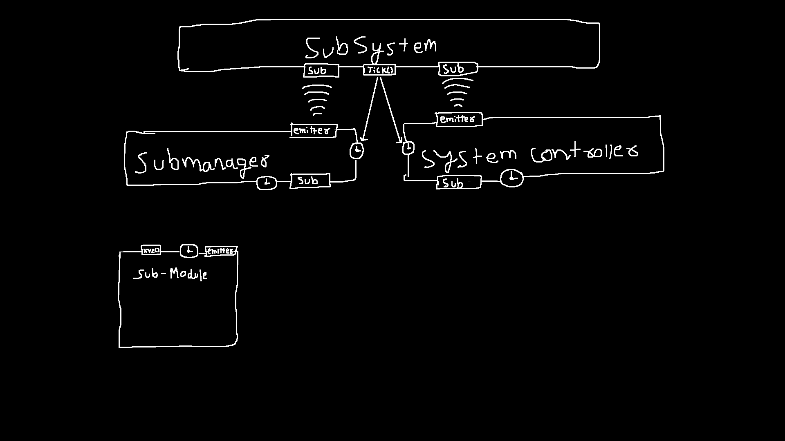

### submodules:  
small&single purpose hardware workers (GPIO scan, encoder read, display flush, network RX, etc.).

`init()`
`start()`
`tick()`
`stop()`
`emit(event)`
`handleOrSink(directive)`

## submanager:  
owns and schedules submodules. centralizes lifecycle and ticking.

`register(submodule)`
`init_all()`
`start(id)` / `stop(id)`
`tick_all()`
`handleModEvent(event)`
`emit(event)`
`handleOrSink(directive)`

# subsystem:  
aggregates submodules, emits raw events upward, executes draw/output intents downward.

`init()`
`tick()`
`handleInternalEvent(event)`
`handleExternalEvent(event)`
`throwInternal(directive)`
`throwExternal(directive)`

## systemcontroller:  
policy + routing layer. interprets events, decides active toolrunner, performs transitions.

`handleRunnerEvent(event)`
`emit(event)`
`transition(toolrunner)`
`handleOrSink(directive)`

### toolrunner:  
execution context/sandbox. owns lifecycle of the tool and mediates interaction with the system. pretty much a condom.

`enter()`
`tick()`
`exit()`
`handleToolEvent(event)`
`emit(event)`
`handleOrSink(directive)`

### tool:  
apps, freedom of logic and state.

`enter()`
`tick()`
`exit()`
`emit(drawintent OR event)`
`handleOrSink(directive)`

### Notes: 
`events` float up, `directives` sink down. `events` are stimuli while `directives` are responses.   
any layer can emit `events` and any layer above that can inforce `directives`, only exception being `tool/submodule` and `subsystem`.  
if a `directive` causes an error, it creates error event to inform subsystem.
`subsystem` ticks everything. it can be considered the heart.

i am NOT writing a GOD DAMNED KERNEL.

